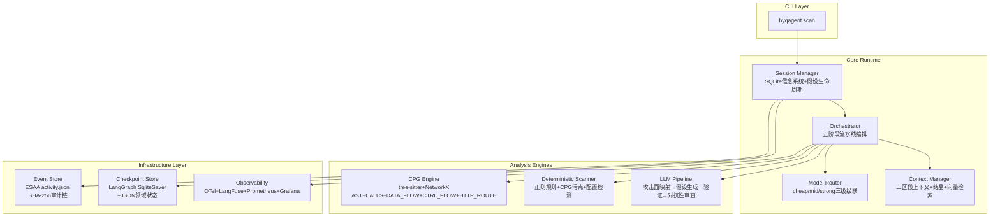

# HyqAgent 代码审计智能体 -- 架构白皮书

> **文档定位**: 项目白皮书，面向新加入开发者、技术决策者、潜在用户。
> **编制日期**: 2026年8月2日
> **上游文档**: 本白皮书整合了9份深度研究/设计文档的核心结论，重在串联与概括。

---

## 1. 项目概览

### 1.1 背景与痛点

传统SAST工具（Semgrep、CodeQL、Bandit）面临三重困境：

| 困境 | 根因 | 数据 |
|:-----|:-----|:-----|
| **检出率低** | 依赖预定义规则，对IDOR、业务逻辑、二阶注入等"无模式"漏洞完全静默 | CodeQL单独检出仅27/120漏洞（IRIS研究）；SECUREAGENTBENCH最佳系统仅15.2%正确率 |
| **误报率高** | AST级语法匹配无法理解代码语义 | CWE Top 25漏洞中大量业务逻辑缺陷完全无法被确定性规则捕获 |
| **无法理解业务意图** | 判断"这个端点是否有越权风险"需要语义推理，而非模式匹配 | 约50%的Bug Bounty高危发现涉及访问控制缺陷 |

与此同时，直接让LLM阅读全部代码存在上下文窗口天花板和幻觉问题：商业模型幻觉率约5.2%，开源模型约21.7%，且在漏洞检测场景下会"流畅地描述不存在的漏洞"。

**HyqAgent的核心命题**：用CPG（代码属性图）提供精确的结构化分析能力，用LLM提供语义理解能力，两者互补，达到接近多Agent的检出率，同时保持单Agent的成本优势。

### 1.2 核心能力

- **单Agent + CPG + 多模型级联**：一个主Agent通过CPG按需提取代码切片，而非直接阅读全部代码
- **五级危害 x 七层挖掘阶梯**：CRITICAL级（CVSS 9.0-10.0）7层全量挖掘到人工签字，INFO级仅1层确定性扫描
- **200+细粒度检测项**：覆盖17大类，与OWASP ASVS v4/v5对齐，134项确定性可检测（67%）
- **完整的可观测性与审计链**：SHA-256防篡改事件日志，每项发现可追溯到具体代码行和模型调用

### 1.3 与现有工具对比

| 维度 | Semgrep/CodeQL | Bandit | HyqAgent |
|:-----|:--------------|:-------|:---------|
| 分析方法 | AST模式匹配 | AST+预定义规则 | CPG数据流+LLM语义推理 |
| IDOR/业务逻辑 | 完全静默 | 完全静默 | LLM语义检测 |
| 精确率 | 中 | 中-高 | 78.43%（CPG+LLM组合，RepoAudit数据） |
| 幻觉控制 | N/A | N/A | L1确定性验证+L2强模型验证两层过滤 |
| 成本/项目 | 零 | 零 | $1（quick）/$5（standard）/$25（deep） |
| 语言支持 | 多语言 | Python | 初版Python/JS/Java，框架级提取器 |

---

## 2. 核心理念与创新

### 2.1 从"单轮问答"到"长任务自主审计"

传统LLM安全审计是单轮交互："给你一段代码，找出漏洞"。HyqAgent的范式是一个**持续数小时到数天的自主审计过程**：

- **持久化记忆**：SLQite信念系统+三区段上下文模型（固定5K+长期30K+工作60K tokens），每50轮自动结晶摘要
- **可恢复工作流**：事件溯源架构（ESAA），每条决策不可变追加记录，SHA-256链式验证完整审计链
- **收敛性保证**：VDR（漏洞发现率）+EC（端点覆盖率）+RWC（风险加权覆盖率）+C_hat（Chao2完整度估计）四个可度量指标共同决定"审计完成"
- **严格验证闭环**："提出者不等于裁决者"，假设生成和验证使用不同模型，L1确定性验证先行过滤，L2强模型深度验证

### 2.2 四大设计哲学

**哲学一："单Agent + 丰富工具 > 多Agent + 协调开销"**

600-run对照实验的数据表明：MAS-Central和MAS-Decent（协调密集型多Agent架构）甚至不如单Agent。真正的杠杆点不是"更多Agent"，而是"更好的工具"——尤其是CPG。

**哲学二："提出者不等于裁决者"**

生成漏洞假设的Agent和验证漏洞的Agent必须不同，最好用不同模型。这不是为了"多Agent协作"，而是为了防止确认偏见（借鉴OpenHack的检察官-法官分离设计）。

**哲学三："确定性先行，LLM后行"**

不要在可以用正则/tree-sitter/CPG确定的事情上花LLM的钱。40%的扫描任务（确定性规则扫描）消耗0%的LLM预算。

**哲学四："模型级联经济学"**

便宜模型（Kimi K2/GLM-5.1，~$0.50/1M tokens）处理分类和摘要，中等模型（Claude Sonnet 4.6）做假设生成，强模型（Claude Opus 4.6/GPT-5.2）做最终验证。成本比 1:30:150。

### 2.3 五级危害 x 七层挖掘阶梯

不同危害等级的漏洞需要不同的挖掘深度，而非"挖或不挖"的区别：

```
危害等级         CVSS         预算占比    挖掘深度        验收标准
────────────────────────────────────────────────────────────────
CRITICAL   9.0-10.0       40%        L1-L7全量      100% L7人工签字
HIGH        7.0-8.9        30%        L1-L5必选      95% L4验证率
MEDIUM      4.0-6.9        20%        L1+L3必选      L1规则100%覆盖
LOW         0.1-3.9         7%        L1扫描        盲区清单
INFO        0               3%        L1自动         自动汇总
```

**七层挖掘阶梯**：

| 层 | 方法 | 成本/发现 | 适用 |
|:--|:-----|:--------|:-----|
| L1 确定性规则引擎 | 正则+CPG污点追踪 | ~$0 | 默认必选 |
| L2 CPG反向分析 | sink->source全量回溯 | ~$0.01 | 默认必选 |
| L3 LLM假设生成 | 中等模型+CPG切片提示 | ~$0.10 | 中置信+ |
| L4 LLM深度验证 | 强模型+完整上下文 | ~$0.50 | HIGH+ |
| L5 对抗性审查 | 攻击者视角审视"安全"路径 | ~$0.25 | CRITICAL+HIGH |
| L6 动态PoC验证 | 沙箱隔离执行 | ~$2.00 | CRITICAL |
| L7 人工签字 | 安全专家独立审查 | 人力成本 | CRITICAL |

**设计依据**：CISA KEV 2025数据——OS命令注入18个KEV（#1）、反序列化14个（#2）、路径遍历13个（#3）。CRITICAL漏洞遗漏代价极大（MOVEit单漏洞$9.2B损失），因此预算分配向高危倾斜（CRITICAL+HIGH占70%）。

### 2.4 检测矩阵覆盖范围

200+项细粒度检测项，覆盖17大类：

| 大类 | 项数 | 重点 |
|:-----|:----|:-----|
| 输入验证 (INPUT) | 27 | 类型/长度/格式/编码/XXE |
| 认证 (AUTH) | 20 | JWT/OAuth/SAML/多因素/暴力破解 |
| 授权 (AUTHZ) | 12 | 水平/垂直越权/CORS/Mass Assignment/多租户 |
| 会话 (SESSION) | 11 | 令牌/Cookie/固定/超时/CSRF |
| 数据库 (SQL) | 10 | 参数化/ORM/NoSQL/二阶注入 |
| 反序列化 (DESERIALIZE) | 6 | Java/Python/Jackson/YAML |
| 其他11类 | 102 | 加密/文件系统/业务逻辑/客户端/供应链等 |

验证方式分布：确定性134项（67%），LLM辅助43项（21.5%），需动态验证23项（11.5%）。

---

## 3. 系统架构总览

### 3.1 宏观架构



> **实现进度**（2026-08-05）：CPG Engine 的 Parser/Traverser/CallGraph/LanguageProvider 已实现（~2,700行，240 tests）。Core Runtime 的 protocols.py/state.py/events.py 已实现。其余模块（Scan Engine、Model Router、Context Manager、Infrastructure）为设计阶段，仅 `__init__.py` 骨架。详见 `progress.md`。

### 3.2 模块划分

| 模块 | 职责 | 核心组件 | 状态 |
|:-----|:-----|:--------|:----|
| **CPG Engine** | 代码属性图构建与查询 | ✅ tree-sitter多语言解析（Parser）、AST遍历器（Traverser）、LanguageProvider策略模式（`languages/`包）、单文件调用图（SingleFileCallGraph）、跨文件调用图（CallGraphBuilder）<br>📋 数据流追踪、CPG查询接口、框架提取器（Flask/Django/FastAPI/Express/Spring） | 🔄 部分实现 |
| **Scan Engine** | 五阶段流水线执行 | Phase1确定性→Phase2攻击面映射→Phase3假设生成→Phase4验证→Phase5报告 | 📋 设计阶段 |
| **Model Router** | 三级模型按任务类型路由 | cheap/mid/strong分级，预算自动降级，成本追踪 | 📋 设计阶段 |
| **Session Manager** | 信念系统与假设生命周期 | SQLite持久化，贝叶斯置信度更新，状态机（proposed→confirmed/rejected） | 📋 设计阶段 |
| **Context Manager** | 三区段上下文+向量检索 | Prompt Caching、上下文结晶协议、Qdrant语义检索 | 📋 设计阶段 |
| **Orchestrator** | 工作流编排+事件溯源 | ESAA六条审计不变量，工作流引擎，检查点与恢复 | 📋 设计阶段 |

> 图例：✅ 已实现　📋 设计/计划阶段　🔄 部分实现

### 3.3 数据流与状态管理

```
Agent（认知层） → JSON意图 → Orchestrator（确定性验证） → activity.jsonl（不可变追加）
                                                    ↓
                                          Materialized View
                                          （供Agent使用的衍生投影）
```

核心原则：**Agent从不直接变更状态**——只发出结构化意图，由确定性Orchestrator验证Schema后持久化。所有动作不可变追加记录，SHA-256哈希链保证防篡改。

**检查点触发策略**（混合驱动）：
- 事件驱动：每Phase完成、每假设状态变更
- 时间驱动：每5分钟（安全网）
- 阈值驱动：Token消耗每增加10%
- 信号驱动：SIGTERM优雅关闭

**恢复RTO < 1秒**：不重放全部历史，而是注入~2000 token的"状态摘要"让Agent快速回到上下文。

---

## 4. 关键设计决策（Why）

### 4.1 为何单Agent + 多视角而非多Agent？

**实证结论**（RESEARCH.md第2章）：

| 架构 | 检出率 | 成本/发现 | 结论 |
|:-----|:------|:--------|:-----|
| SAS（单Agent+工具） | 50.8% | $0.058 | 帕累托最优性价比 |
| MAS-Indep（3 Agent独立） | 64.2% | $0.143 | 最高检出率，但2.5x成本 |
| MAS-Central（中心化编排） | 未超越SAS | — | 编排器成瓶颈 |
| MAS-Decent（对等投票） | 未超越SAS | — | 投票保守偏见导致漏检 |

**核心洞察**（IMPLEMENTATION-GUIDE.md）：业界**没有任何成熟系统按sink生成子Agent**。109-Agent真实案例中79%的Agent在做无用功。多样性红利（+13.4pp）来源于不同的分析视角，而非不同的Agent进程。

**HyqAgent选择**：单Agent + 三视角Prompt（Security Auditor / Attacker / Completeness Critic），同一Agent、不同prompt、隔离上下文。捕获MAS-Indep多样性红利的大部分，但无协调开销。

### 4.2 长任务持续运行的保障机制

引用LONG-RUNNING-AGENT-ARCHITECTURE.md的核心创新：

**一条公式**：长期运行Agent = 持久化记忆 + 可恢复工作流 + 有策略探索 + 严格验证闭环 + 透明运行。

**五个关键机制**：

1. **三区段上下文模型**：固定区段 (~5K, Prompt Cache) + 长期记忆 (~30K, 结晶摘要) + 工作记忆 (~60K, 滑动窗口)。每50轮自动触发上下文结晶。
2. **事件溯源架构（ESAA）**：六条审计不变量（claim-before-work等）保证决策可追溯、可重放、可验证。
3. **三层验证循环**：Tier1饱和扫描（同类漏洞循环发现直到收敛）→ Tier2完整性审查（Completeness Critic）→ Tier3跨类对抗审查（链式利用检查）。
4. **多维度收敛标准**：VDR=0x3轮 + EC>=95% + RWC>=98% + VCC>=90% + C_hat>=0.85，全部满足才能报告"已完成"。
5. **熔断与降级**：连续失败3次触发模型降级（Opus→Sonnet→Haiku→纯规则），5轮后仍未收敛升级到人工。

### 4.3 如何平衡检出率与成本？

COVERAGE-GAP-ANALYSIS.md的核心发现：当前Pipeline设计存在**系统性覆盖盲区**——Phase 1确定性预扫描是有损过滤器，不匹配规则的代码路径被永久丢弃。

**三个最低成本改进**（总成本 < $0.05）：
1. **反向CPG查询**：从每个sink反向追踪到所有可达的用户输入点，启发式标记"可能是危险的"函数调用 —— $0成本
2. **Phase 2 Prompt扩展**：攻击面映射时增加漏洞模式扫描问题 —— $0.02
3. **Completeness Critic**：所有阶段完成后用强模型回答"我们漏了什么" —— $0.02

**性价比对比**：

| 架构 | 估计召回率 | 估计成本/发现 |
|:-----|:---------|:------------|
| SAS基线 | 50.8% | $0.058 |
| MAS-Indep | 64.2% | $0.143 |
| HyqAgent standard（当前设计） | ~35% | ~$0.05 |
| HyqAgent standard（+缓解方案） | ~50% | ~$0.06 |
| HyqAgent deep（+缓解方案） | ~60% | ~$0.12 |

加入缓解方案后，standard模式可以在几乎不增加单位成本的前提下，将召回率从~35%提升到~50%。

### 4.4 生产级开发规范如何落地

DEVELOPMENT-STANDARDS.md的核心原则：

- **SOLID原则**：Orchestrator依赖CpgAnalyzer和AuditRepository协议，永不直接import joern或sqlite3。新增漏洞类型=实现BaseTool并注册到ToolRegistry，核心零改动。
- **五层测试模型**：L1确定性单元测试（pytest）→ L2集成测试（mock LLM）→ L3功能测试（DeepEval语义评估）→ L4回归测试（Promptfoo统计性）→ L5人工评估。
- **Eval-Driven Development**：先写eval再写prompt，Golden Dataset分dev/test集，生产FP/FN持续回流。
- **成本归因**：每条LLM调用自动标记finding_id+phase，精确回答"发现HYQ-0421花了$0.0234"。
- **五层Prompt注入防护**：输入净化→结构分离→安全守卫→工具白名单→输出验证。

---

## 5. 实现路径与模块详解

### 5.1 五阶段主工作流

```
全部代码
    │
    ▼
Phase 1: Deterministic Pre-scan (0 LLM tokens)
    正则+CPG污点追踪+配置检测
    覆盖~20-35%漏洞类别
    │
    ▼
Phase 2: Attack Surface Mapping (cheap model)
    分类每个API端点的功能和风险
    按priority排序，过滤出高风险端点
    │
    ▼
Phase 3: Hypothesis Generation (mid model)
    CPG切片提示——不是全量代码，而是路径上的具体语句
    生成结构化漏洞假设（CWE编号、可利用性评估、攻击场景）
    │
    ▼
Phase 4: Hierarchical Validation
    L1确定性验证：CPG确认路径真实存在、source/sink类型匹配
    L2 LLM验证：强模型严格验证假设（可达性、绕过、消毒充分性、框架保护）
    │
    ▼
Phase 5: Report Assembly (0 LLM tokens)
    按严重度排序，生成JSON/Markdown/SARIF
    每个发现含证据链、数据流步骤、修复建议、验证历史
```

### 5.2 CPG Engine -- 系统基石

CPG由五种图组成，存储在同一个NetworkX MultiDiGraph中：

| 边类型 | 含义 | 用途 |
|:-------|:-----|:-----|
| AST | 语法父子关系 | 代码结构理解 |
| CALLS | 函数A调用函数B | 调用链分析 |
| DATA_FLOW | 数据从表达式A流向表达式B | 污点追踪的核心 |
| CTRL_FLOW | 控制流（分支/循环） | 可达性分析 |
| HTTP_ROUTE | HTTP路由信息 | Web入口点识别 |

**已实现组件**（Session 1.2-1.5）：

| 组件 | 文件 | 说明 |
|:-----|:-----|:-----|
| Parser | `cpg/parser.py` | 多语言 tree-sitter 解析器，通过 LanguageProvider 委托语言特定操作 |
| Traverser | `cpg/traversal.py` | AST 遍历器，支持 DFS 前序/后序、节点过滤、导航工具 |
| SingleFileCallGraph | `cpg/callgraph.py` | 单文件调用图，支持 Python/JS/Java |
| CallGraphBuilder | `cpg/callgraph_builder.py` | 跨文件调用图构建器，索引→导入解析→跨文件调用边 |
| LanguageProvider | `cpg/languages/` | **策略模式可扩展架构**：添加新语言=1个文件+1行注册，核心零改动 |
| types | `cpg/types.py` | 共享数据类（FunctionNode/ClassNode/ImportNode/CallEdge） |

**LanguageProvider 可扩展架构**：每种语言实现一个 `LanguageProvider` 子类（14个抽象成员），注入到 Parser 和 SingleFileCallGraph。当前支持 Python/JavaScript/Java。添加 Go：只需新增 `languages/go.py` + 在 `__init__.py` 中注册一行。

**关键性能数据**（LLMxCPG论文）：CPG精确切片后→LLM，F1 > 99%（Juliet数据集），对比全量代码→LLM的F1 ~40%。

**框架特定提取器**：每种Web框架（Flask/Django/FastAPI/Express/Spring）需要一个提取器，识别路由模式、提取参数、标记HTTP方法和路径。这些提取器是纯确定性的，用tree-sitter或正则即可。

### 5.3 单Agent + 多视角的具体实现

```
同一段代码，同一个Agent，不同的Prompt，隔离的上下文：

Pass 1: Security Auditor视角
  "你是安全审计员。找出这段代码中所有可被利用的漏洞。"

Pass 2: Attacker视角
  "你是攻击者。审计员说这段代码是安全的。证明他们错了。
   尝试绕过所有防护措施。"

Pass 3: Completeness Critic视角
  "审计员和攻击者都看过了。他们漏了什么？
   哪些漏洞类型没被检查？哪些假设可能是错的？"
```

### 5.4 上下文管理与记忆持久化

**Prompt Caching策略**（预期节省~90%成本、~85%延迟）：
- Cache Point 1：系统prompt + 漏洞分类（稳定、高重用，每会话缓存）
- Cache Point 2：长期记忆/结晶状态（缓慢变化，每轮次更新）
- 不缓存：工作记忆（每轮变化）

**向量化代码检索**（Qdrant/ChromaDB，函数级切片粒度）：
- "这段代码我之前分析过吗？" -- 相似度>85%自动复用结论
- 混合检索：ripgrep（精确）+ tree-sitter（结构）+ Qdrant（语义）+ Joern（数据流）

### 5.5 模型级联与预算控制

```
任务量占比      模型选择          成本占比
确定性扫描      40%    无LLM             0%
攻击面分类      25%    Kimi K2 ($0.50)   ~1%
简单假设生成    15%    Kimi K2 ($0.50)   ~2%
复杂假设生成    10%    Sonnet ($3/$15)   ~15%
中置信验证       7%    Sonnet ($3/$15)   ~32%
高价值验证       3%    Opus ($15/$75)    ~50%
```

优化方向：提高L1确定性验证的过滤率（减少进入强模型的任务量），缓存相似路径验证结果。

---

## 6. 质量保障与可观测性

### 6.1 测试策略

| 层级 | 内容 | 工具 | 确定性 |
|:-----|:-----|:-----|:------|
| L1: 单元测试 | CPG查询、规则引擎、配置解析 | pytest+精确断言 | 100% |
| L2: 集成测试 | LLM+API+RAG端到端 | pytest+mock LLM | 确定性 |
| L3: 功能测试 | 完整工作流，语义相似度 | DeepEval/Braintrust | 概率性 |
| L4: 回归测试 | 版本化Golden Dataset，多次重跑 | Promptfoo | 统计性 |
| L5: 人工评估 | 语义质量、业务正确性 | 标注平台 | 人工 |

**CI/CD三级漏斗**：Pre-commit (<2min) → PR Checks (5-15min) → Nightly Build (1-3h, 完整Golden Dataset+20次重跑)。

### 6.2 可观测性体系

```
OTel GenAI SDK → OTLP Collector → LangFuse（自托管，MIT）
                                 → ClickHouse（长期分析）
                                 → Grafana（实时仪表盘）

structlog（JSON） → stdout → 日志聚合

Prometheus Metrics → /metrics端点 → Grafana告警
```

**关键指标**：LLM调用量/成本/延迟（按model+phase）、发现计数（按severity+cwe）、假设状态分布、端点覆盖率、预算消耗。

**告警规则**：预算>85%（critical）、LLM错误率>30%（critical）、P95延迟>120s（warning）、覆盖率<70%（warning）、会话停滞30min（critical）。

### 6.3 持续改进的数据飞轮

```
用户报告FP/FN → 反馈审核队列 → 反馈数据库（版本标记）
                                    ↓
                              分析引擎（FP率按规则 / FN模式聚类）
                              ↓                      ↓
                          规则更新              检测能力仪表盘
                    （调阈值/白名单/优先级）    （趋势/对比/分布）
```

**数据飞轮五层安全防护**：双人盲审+人类专家准入 → 隔离沙箱训练+金标准评估 → 漂移检测+自动回滚 → 红队测试+变异测试 → 联邦学习隔离+差分隐私。

参考BitsAI-CR（字节跳动，FSE 2025）12,000+周活用户的生产实践：Outdated Rate机制自动退役"理论上正确但实际无用"的规则。

---

## 7. 部署与运行指南（简要）

### 7.1 环境要求

- Python 3.12+（src-layout，PEP 517）
- tree-sitter + Python/JS/Java语法
- Joern（CPG构建）或自建tree-sitter CPG
- SQLite（零运维，WAL模式）
- Docker（沙箱PoC验证，可选）
- 模型API Key：Anthropic（Claude Sonnet/Opus），OpenAI兼容（Kimi/GLM）

### 7.2 CLI命令

```bash
# 快速扫描（$1预算，CI/CD门禁，~2h）
hyqagent scan ./myapp --quick

# 标准扫描（$5预算，默认模式，~8h）
hyqagent scan ./myapp

# 深度扫描（$25预算，发布前审计，~20h）
hyqagent scan ./myapp --deep

# 指定语言和框架
hyqagent scan ./myapp --lang python --framework flask

# 续扫
hyqagent resume <session-id>

# 生成报告
hyqagent report <session-id> --format sarif
```

### 7.3 长任务管理

- **暂停/恢复**：SIGTERM自动保存检查点，`hyqagent resume`恢复，RTO < 1秒
- **增量扫描**：`--incremental`模式仅分析变更文件+受影响调用者
- **优雅降级**：预算耗尽时自动从STRONG→MID→CHEAP逐级降级
- **systemd守护**：`Restart=always`，60秒内最多重启3次防止crash-loop

---

## 8. 未来规划与可扩展方向

### 8.1 短期迭代目标（MVP阶段，7周）

| 周 | 阶段 | 验证目标 |
|:--|:-----|:--------|
| 1-2 | Baseline | Bandit+Semgrep跑10个已知CVE项目，建立TP/FP基准 |
| 3-4 | CPG-only | Joern生成CPG，写3-5个CPGQL查询，验证CPG是否比AST模式匹配FP更低 |
| 5-6 | CPG+LLM | CPG切片→LLM分类，验证LLM是否能显著提升precision |
| 7 | 三方对比报告 | 决定是否继续投入LLM |

MVP范围：Python一种语言、5种漏洞类型（命令注入/SQL注入/反序列化/路径遍历/硬编码密钥）、Flask一种框架。

### 8.2 中期目标（Phase 2，15-20周）

- 七种盲区缓解方案全面部署（反向CPG+盲扫LLM+Completeness Critic+饱和扫描+差异覆盖+对抗性审查+架构感知）
- 多语言扩展（JavaScript/Java）
- 沙箱PoC验证（L6）集成
- Eval基准构建（50-100个真实Web漏洞回归集）

### 8.3 长期演进

- **阶段性多Agent引入**：第一个ROI为正的增量是一个独立的Critic/Verifier Agent（不同模型家族），审查主Agent发现
- **交互式审查模式**：人类专家可在Agent运行过程中注入问题/重定向分析
- **持续学习闭环**：生产FP/FN反馈 → 自动规则调整 → A/B测试验证
- **CI/CD深度集成**：GitHub App/CLI插件，PR自动安全Review

---

## 附录

### A. 术语表

| 术语 | 说明 |
|:-----|:-----|
| **CPG** | Code Property Graph，代码属性图 = AST + 调用图 + 数据流图 + 控制流图 + HTTP路由图的统一图表示 |
| **SAST** | Static Application Security Testing，静态应用安全测试 |
| **SAS** | Single Agent System，单Agent系统 |
| **MAS** | Multi-Agent System，多Agent系统 |
| **IDOR** | Insecure Direct Object Reference，不安全的直接对象引用（越权漏洞） |
| **ESAA** | Event-Sourced Autonomous Agent，事件溯源自治Agent架构 |
| **VDR** | Vulnerability Discovery Rate，漏洞发现率 |
| **EC** | Endpoint Coverage，端点覆盖率 |
| **RWC** | Risk-Weighted Coverage，风险加权覆盖率 |
| **Eval** | Evaluation，基于Golden Dataset的结构化评估 |
| **EDD** | Eval-Driven Development，评估驱动的开发范式 |

### B. 相关文档索引

| 文档 | 说明 |
|:-----|:-----|
| [RESEARCH.md](./RESEARCH.md) | 原始研究报告：20+论文、15+系统对比、架构决策的实证基础 |
| [PLAN.md](./PLAN.md) | 完整设计方案：架构总览、五阶段流水线、CPG Engine、实现路线图 |
| [COVERAGE-GAP-ANALYSIS.md](./COVERAGE-GAP-ANALYSIS.md) | 覆盖盲区深度分析：Phase 1遗漏的漏洞类别、七种互补缓解方案 |
| [severity_based_vulnerability_mining_framework.md](./severity_based_vulnerability_mining_framework.md) | 五级危害分类体系与七层挖掘阶梯：CRITICAL必须7层全量 |
| [detection_matrix.json](./detection_matrix.json) | 200项ASVS对齐的结构化检测项（17大类，142KB） |
| [WEB-VULN-FULL-MATRIX.md](./WEB-VULN-FULL-MATRIX.md) | 180+漏洞类型的全量覆盖矩阵：危害分级x检测可行性交叉 |
| [LONG-RUNNING-AGENT-ARCHITECTURE.md](./LONG-RUNNING-AGENT-ARCHITECTURE.md) | 长任务持续运行架构：事件溯源、检查点、收敛性保证、可观测性 |
| [IMPLEMENTATION-GUIDE.md](./IMPLEMENTATION-GUIDE.md) | 实现前必读：CPG跨文件调用图风险评估、多Agent决策、MVP建议 |
| [DEVELOPMENT-STANDARDS.md](./DEVELOPMENT-STANDARDS.md) | 生产级开发规范：SOLID架构、五层测试、可观测性、Prompt管理 |

---

> **核心原则重申**：
> 1. 单Agent + 丰富工具（CPG）> 多Agent + 协调开销 -- 真正的杠杆点不是Agent数量
> 2. 提出者不等于裁决者 -- 生成假设和验证假设必须分离，防止确认偏见
> 3. 确定性先行，LLM后行 -- 不要在用正则/CPG能确定的事情上花LLM的钱
> 4. 不同危害等级 = 不同挖掘深度 -- CRITICAL必须穷举到L7，不能有丝毫妥协
> 5. "我们漏了什么"必须是系统内置的主动检测机制，而非被动声明
> 6. Precision是唯一重要的指标 -- 宁可漏掉一些漏洞，也不要报告不存在的漏洞
> 7. 所有决策可追溯、可重放、可验证 -- 安全审计的底线是"你的判断有证据吗？"
